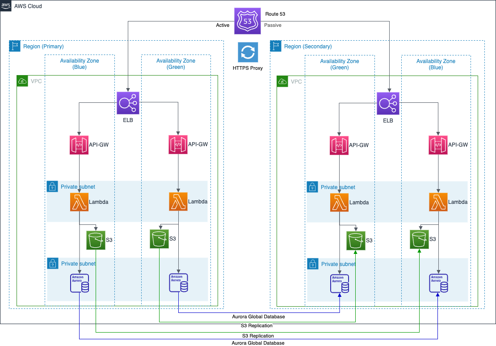

#serverless-cdk
## Built-up manually from the ground up to showcase

- AWS CDK
- TypeScript
- Managing of CloudFormation automation code for provisioning of Amazon AWS resources including:
  - Route 53 Weighted RecordSets
  - API Gateway REST services
  - API Gateway Custom Domains
  - Lambda functions
  - API Gateway Custom Authorizers
  - S3 Buckets
  - Aurora 

## How to Use
Knowledge of and prior configuration of the AWS CDK is assumed.  See below for useful commands.  Otherwise, the following provides for a few useful scenarios:

* `APP_ID={appid} INCLUDE_REPLICATION=no DNS_RECORD_SET={recordName} HOSTED_ZONE_ID={zoneId} CERTIFICATE_DOMAIN_NAME={certName} cdk deploy --all` deploys the application using the `APP_ID` value as unique identifier for the resources, including additional required options to configure Route 53 weighted record sets into an existing hosting zone using the hosting zone's unique id and the desired name for the weighted record set (e.g. 'subdomain.domain.net'), as well as the SSL/TLS certificate's domain name (e.g. '*.domain.net').  NOTE: this assumes an existing hosting zone and ACM certificate, configuration of which are outside the scope of this project.  Note also that the S3 Buckets do not receive S3 Replication initially.

* `APP_ID={appid} INCLUDE_REPLICATION=yes DNS_RECORD_SET={recordName} HOSTED_ZONE_ID={zoneId} CERTIFICATE_DOMAIN_NAME={certName} cdk deploy --all` performs a second deployment with the same options but enables S3 Replication.

NOTE: It is important to note that in order to deploy the S3 Replication rules across regions/stacks, a basic deployment must first be completed WITHOUT the rules, followed by the same deployment -- same stack(s) -- but with the replication options in place.  To accomplish this, deploy the app without, then with the `INCLUDE_REPLICATION` environment variable set, as documented above.

* `APP_ID={appid} INCLUDE_REPLICATION=yes DNS_RECORD_SET={recordName} HOSTED_ZONE_ID={zoneId} CERTIFICATE_DOMAIN_NAME={certName} PRIMARY_WEIGHT=0 SECONDARY_WEIGHT=100 cdk deploy --all` performs a failover of the Route 53 Weighted Record Sets to force routing to the secondary region/resources.

* `APP_ID={appid} INCLUDE_REPLICATION=yes DNS_RECORD_SET={recordName} HOSTED_ZONE_ID={zoneId} CERTIFICATE_DOMAIN_NAME={certName} cdk destroy --all` deletes the deployed stacks, effectively decommissioning the resources.  It may be necessary to revisit the cloud account to ensure all resources have been removed to eliminate additional charges; for this, delete any remaining CloudFormation stacks and/or manually decommission resources not deleted through automation due to protection rules or other dependencies, such as S3 Buckets, RDS databases and networking resources.

NOTE: Replace the tokens in the example accordingly; these are defined below:

- `APP_ID` is a unique identifier for the CDK application and is used throughout the project to ensure uniqueness in certain cases; for instance in the naming of the S3 Buckets where global uniqueness is required.  While the length constraints for this value actually depend on the specific resource that uses the appId, a short value (1-10 characters) is recommended; this field is required
- `INCLUDE_REPLICATION={yes|true|no|false}` provides the optional configuration of S3 Replication rules, used by conditional logic in the appropriate stack.  If truthy (yes|true), configures S3 Buckets with S3 Replication settings enabled.  If falsy (no|false) or if not set (default), configures S3 Buckets without S3 Replication.  Note that once replication is enabled by setting this value to truthy, it would be disabled by additional deployments that pass a falsy value.  This may be the intended behavior, but the more likely scenario is (1) on initial deployment pass falsy to allow the S3 Buckets to be created and (2) via a second (and all subsequent) deployment(s), pass a truthy value; this field is optional
- `HOSTED_ZONE` domain name of the pre-configured Route 53 Record Hosted Zone into which to create the Record Sets; this field is required
- `DNS_RECORD_SET` sub-domain name of the desired Route 53 multi-region, weighted Record Sets; also serves as the name of the API Gateway Custom Domain; this field is required
- `CERTIFICATE_DOMAIN_NAME` domain name of the ACM certificate that corresponds with the Hosted Zone; this field is required
- `PRIMARY_WEIGHT` value of the primary Route 53 Record Set's weight, denoting the desired weighted routing strategy; default is 100
- `SECONDARY_WEIGHT` value of the secondary Route 53 Record Set, intended as an inverse of the primary weight value in order to ensure an active-passive strategy; default is 0

The `cdk.json` file tells the CDK Toolkit how to execute the app.

## Basic commands

* `npm run build`   compile typescript to js
* `npm run watch`   watch for changes and compile
* `npm run test`    perform the jest unit tests
* `cdk deploy`      deploy this stack to your default AWS account/region
* `cdk diff`        compare deployed stack with current state
* `cdk synth`       emits the synthesized CloudFormation template
* `cdk destroy`      destroys the CloudFormation stack(s); if multiple exist, can provide the name(s) comma-delimited or `--all`

NOTE: The required fields must be used even for these basic commands; e.g. `{REQUIRED_PARAMS} cdk synth`

### Disclaimer 
Use of this solution is for academic purposes only and neither this site nor contributors to this repository are liable for costs resulting from use of any automation code contained nor referenced within.  Use at your own discretion and ensure to understand the risks of provisioning cloud infrastructure and resources, especially through automation.  It is highly encouraged to have a solid understanding of the cloud service provider(s) used and the processes for identification of provisioned resources and related costs, as well as how to decommission resources to reduce and eliminate costs.

### Credits and Resources:
- https://docs.aws.amazon.com/AmazonS3/latest/userguide/using-aws-javascript.html
- https://sbstjn.com/blog/aws-cdk-s3-cross-region-replication-kms/
- https://sbstjn.com/blog/aws-cdk-lambda-loadbalancer-vpc-certificate/
- https://nikhil-zadoo.com/custom-resources-with-aws-cdk
- https://stackoverflow.com/questions/67361096/how-can-i-zip-node-lambda-dependencies-in-aws-cdk-stack
- https://docs.aws.amazon.com/cdk/api/v2/docs/aws-cdk-lib.custom_resources-readme.html
- https://github.com/aws/aws-cdk/issues/1635
- https://docs.aws.amazon.com/cdk/api/v1/docs/@aws-cdk_core.AppProps.html
- https://stackoverflow.com/questions/6248666/how-to-generate-short-uid-like-ax4j9z-in-js
- https://app.diagrams.net/
- https://aws.amazon.com/blogs/architecture/disaster-recovery-dr-architecture-on-aws-part-i-strategies-for-recovery-in-the-cloud/
- https://docs.aws.amazon.com/AmazonS3/latest/userguide/replication-config-for-kms-objects.html
- https://bobbyhadz.com/blog/environment-variables-aws-cdk
- https://github.com/aws/aws-cdk/issues/3235
- https://aws.amazon.com/premiumsupport/knowledge-center/s3-troubleshoot-replication/
- https://www.digitalocean.com/community/tools/minify
- http://jwtbuilder.jamiekurtz.com/
- https://5k-team.trilogy.com/hc/en-us/articles/360016983399-Custom-Authorizer-in-API-Gateway-REST-CDK-Recipe
- https://aws.plainenglish.io/custom-dns-for-private-api-gateway-5940cb4889a8
- https://aws.amazon.com/blogs/networking-and-content-delivery/starting-small-with-aws-global-accelerator/
- https://repost.aws/questions/QUjISNyk6aTA6jZgZQwKWf4Q/how-to-connect-a-load-balancer-and-an-interface-vpc-endpoint-together-using-cdk
- https://dev.to/wakeupmh/create-aurora-mysql-on-top-of-cdk-with-ts-3949
- https://github.com/neilkuan/cdk-aurora-globaldatabase