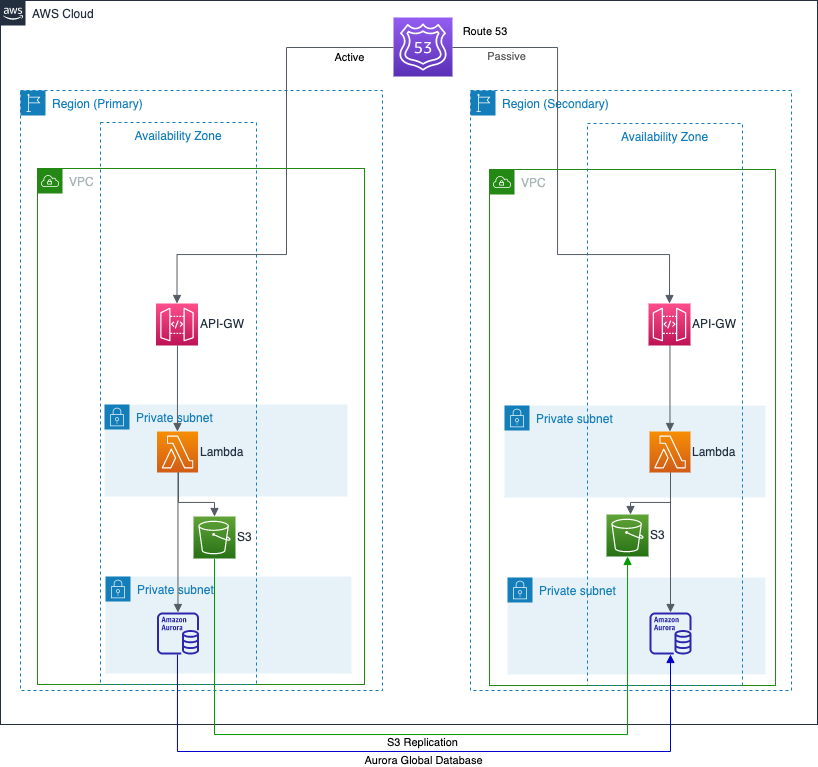

#serverless-cdk
## Built-up manually from the ground up to showcase

- AWS CDK
- TypeScript
- Managing of CloudFormation automation code for stacks involving:
  - Infrastructure (including provisioning of TODO);

The `cdk.json` file tells the CDK Toolkit how to execute the app.

## Useful commands

* `npm run build`   compile typescript to js
* `npm run watch`   watch for changes and compile
* `npm run test`    perform the jest unit tests
* `cdk deploy`      deploy this stack to your default AWS account/region
* `cdk diff`        compare deployed stack with current state
* `cdk synth`       emits the synthesized CloudFormation template

### NOTE: 
Use of this solution is for academic purposes only and neither this site nor contributors to this repository are liable 
for costs resulting from use of any automation code contained nor referenced within.  Use at your own discretion 
and ensure to understand the risks of provisioning cloud infrastructure and resources, especially through automation.  
It is highly encouraged to have a solid understanding of the cloud service provider(s) used and the processes for 
identification of provisioned resources, as well as how to decommission resources to reduce and elimiate costs.